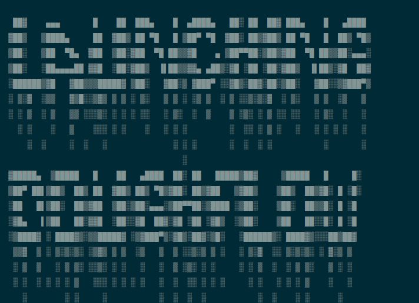
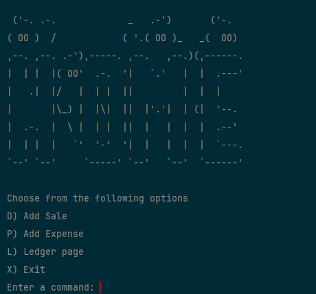
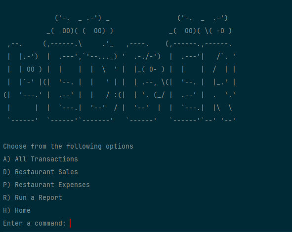
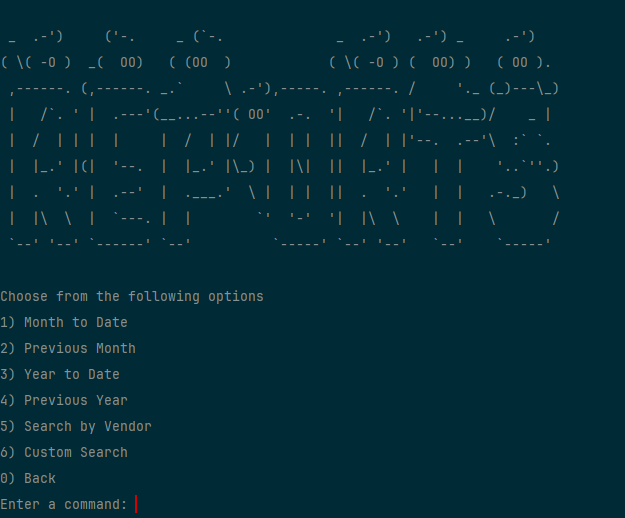
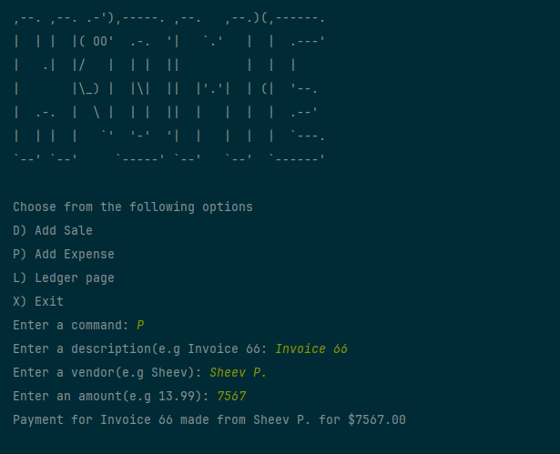
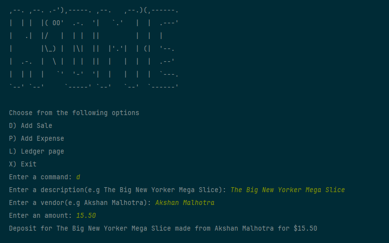
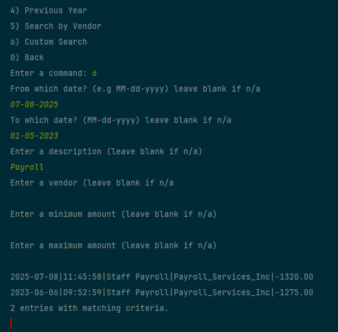

# 🍕 DoughFlow
### *Command-Line Ledger for Pizza Shop Transactions*

DoughFlow is a **Java based command line application** designed to manage and track financial transactions for a pizza restaurant. Built as a **capstone project**, it provides an intuitive CLI interface where users can add deposits, record payments, and generate reports, all stored neatly in a CSV ledger.

---

## 🧾 Features

### 🏠 Home Screen
Users can navigate through the main menu to manage transactions and reports:
- **D)** Add Sale – Prompts user for sale info and saves it to the CSV file
- **P)** Add Expense – Prompts user for expense info and saves it to the CSV file
- **L)** Ledger page – Displays all transactions in descending order by date
- **X)** Exit – Exits the application

### 📘 Ledger Screen
The Ledger menu provides several viewing and reporting options:
- **A)** All Transactions – Display all transactions
- **D)** Restaurant Sales – Display only sales
- **P)** Restaurant Expenses – Display only expenses
- **R)** Reports – Access predefined or custom reports
- **H)** Home – Return to the home screen

### 📊 Reports
Within the Reports menu, users can view financial summaries or perform searches:
1. Month To Date
2. Previous Month
3. Year To Date
4. Previous Year
5. Search by Vendor
6. Custom Search

   - Date Range
   - Description
   - Vendor
   - Amount
0. Back (return to Ledger)

---

## 💾 Data Storage
All transaction data is stored in a **CSV file**, ensuring persistent and easy-to-read records.

Example (transactions.csv):
```
Date|Time|Description|Vendor|Amount
2025-10-15|11:45:32|Deposit|Pizza Hut|200.00
2025-10-16|13:10:58|Payment|Cheese Supplier|-89.99
```

---

## 💻 Technologies
- **Language:** Java
- **Version:** Corretto-17 SDK
- **Storage:** CSV-based persistence
- **Interface:** Command-Line Interface (CLI) with ASCII art headers

---

## 📁 Project Structure

```plaintext
DoughFlow/
├── src/
│   ├── LedgerApp.java
│   ├── Reports.java
│   ├── Screen.java
│   ├── Transaction.java
├──  transactions.csv
└── README.md
```

---

## 🧩 Interesting Code Snippet

This method powers the **Custom Search** feature. It dynamically filters transactions using Java Streams and lambdas, allowing multiple search criteria at once.

```java
public List<Transaction> searchTransactions(List<Transaction> transactions, 
                                            LocalDate startDate, 
                                            LocalDate endDate, 
                                            String description, 
                                            String vendor, 
                                            Double amount) {
    return transactions.stream()
        .filter(t -> (startDate == null || !t.getDate().isBefore(startDate)))
        .filter(t -> (endDate == null || !t.getDate().isAfter(endDate)))
        .filter(t -> (description == null || t.getDescription().toLowerCase().contains(description.toLowerCase())))
        .filter(t -> (vendor == null || t.getVendor().toLowerCase().contains(vendor.toLowerCase())))
        .filter(t -> (amount == null || t.getAmount() == amount))
        .collect(Collectors.toList());
}
```

**Why it’s interesting:**
Originally, the app had separate methods for filtering by date, vendor, and amount.
By using **lambda expressions**, this single method replaced them all — simplifying the logic and making the codebase more maintainable.

---

## 🖼️ Screenshots

| Screen | Description                                    |
|--------|------------------------------------------------|
|  | Application start screen with ASCII art header |
|  | Main menu navigation                           |
|  | Ledger menu navigation                         |
|  | Predefined report options                      |
|  | Example expense entry output                   |
|  | Example sale entry output                      |
|  | Example custom search and output               |


---

## 🚀 How to Run

1. **Clone the repository:**
   ```bash
   git clone https://github.com/abraham-mendez-code/accounting-ledger.git
   cd accounting-ledger
   ```

2. **Compile the application:**
   ```bash
   javac -d bin src/*.java
   ```

3. **Run the program:**
   ```bash
   java -cp bin Main
   ```

---

## 🔮 Future Improvements
- Develop a more **user-friendly UI** application
- Implement **pagination** to load a limited number of transactions at a time


---

## 🧠 Lessons Learned
- Gained experience using **lambda expressions** to simplify filtering and sorting
- Improved understanding of **data persistence using CSV files**
- Learned how to design a **modular CLI interface** with layered menus

---

## 👨‍💻 Author
**Developed by:** Abraham Mendez  
**Purpose:** Capstone Project – YearUp United Application Development Track

🔗 [GitHub Repository](https://github.com/abraham-mendez-code/accounting-ledger)
